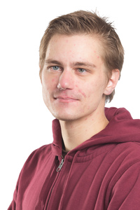
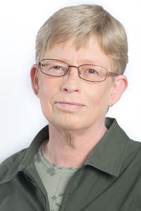

# 69 - Ville Korhonen
## Tulevaisuuden visioita Hankasalmelle

 - 26v tieto- ja viestintäteknologian opiskelija, yrittäjä, asuu Hankasalmen Kovalanmäellä
 - Keski-Suomen Vihreiden varapuheenjohtaja ja Jyväskylän Vihreiden nuorten ja opiskelijoiden hallituksen jäsen
 - henkilökohtainen kotisivu, jonka kautta löydät vaaliteemat: [ypcs.fi](http://ypcs.fi)
 - Facebook: [facebook.com/vipekorh](https://www.facebook.com/vipekorh) (sivu) [facebook.com/ypoocs](https://www.facebook.com/ypoocs) (profiili)
 - Twitter: [twitter.com/ypcs](https://twitter.com/ypcs)
 - sähköposti: [ville.korhonen@vihreat.fi](mailto:ville.korhonen@vihreat.fi)
 - puhelin: 050 303 2101

# 70 - Sirpa Lindholm
## Itsenäisessä kunnassa yhteistyöllä eteenpäin

 - 61v eläkeläinen, ent. laboratoriomestari ja sivutoiminen yrittäjä, asuu Hankamäellä. Pitkä kokemus lautakunta- ja asukasyhteisötyöstä Espoossa.
 - Yhteisöllisyys ja välittäminen kunniaan
 - Päätöksentekoon avoimuutta ja yhteistyökykyä
 - Joukkoliikenneyhteydet paremmiksi
 - Kevyenliikenteen väylä välille Kirkonkylä –Asemankylä – Niemisjärvi
 - Luontoarvoja kunnioitettava
 - Ei kuntaliitoksille, sen sijaan yhteistyön kehittämistä lähikuntien kanssa
 - Jos pakkoliitoksia tehdään, on saatava toimiva paikallisasukasdemokratia ja kansanäänestykset
